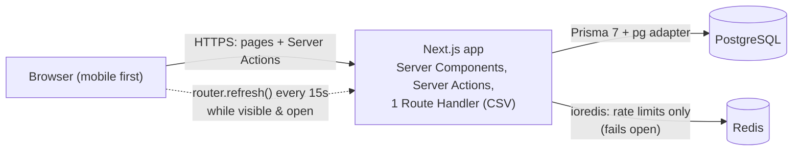
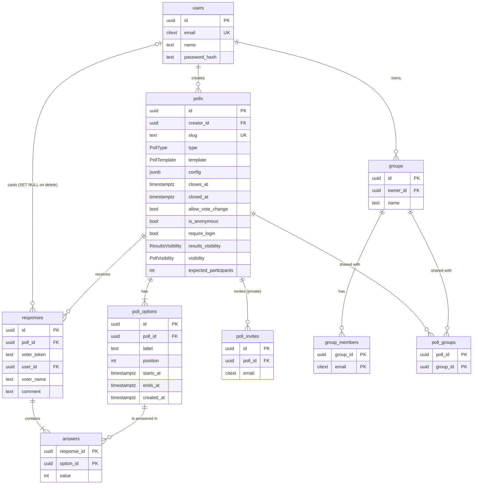

# Poller

A polling + insights app for small groups making a decision together: when to meet, what to build next, where the offsite goes, which workshop to run. Create a poll in a minute, share a link, and get **insights, not just counts**: "Fri 6pm works for 5/6 people (+1 if need be)", who's leading and by how much, whether the group agrees or is split, and what people said.

Built with **Next.js 16** (App Router, Server Actions), **shadcn/ui** (Base UI), **Tailwind CSS v4**, **PostgreSQL** via **Prisma 7**, **Auth.js v5** and **Redis** (rate limiting only).

---

## Contents

- [What it does](#what-it-does)
- [Quick start](#quick-start)
- [Architecture](#architecture)
- [Data model](#data-model)
- [Project structure](#project-structure)
- [Adding a poll type](#adding-a-poll-type)
- [Testing](#testing)
- [Edge cases](#edge-cases)
- [Security & accessibility](#security--accessibility)
- [Decisions & trade-offs](#decisions--trade-offs)
- [Known limitations](#known-limitations)

## What it does

**Four poll types**, each with its own input, validation and insights:

| Type | Voter does | Key insights |
|---|---|---|
| **Choice** (single / multi) | Picks one or up to N options | Leader + margin, share of voters, consensus (strong / some / split), vote-share donut; multi-select adds options-per-voter and a picked-together heatmap |
| **Availability** | Marks each time slot *Yes / If need be / No* | Best slot as a sentence ("Fri 6pm works for everyone (4/4)"), slots grouped by day, a day-by-day availability heatmap, voter's local time shown next to the poll's |
| **Ranking** | Taps options in order of preference (top N or all) | Borda points, average rank, first-choice share, tie detection, rank-breakdown heatmap, head-to-head matrix with Condorcet winner |
| **Rating** | Scores each option 1–5 or 1–10 | Average, median, histogram, **"opinions split"** when many rate very low *and* very high, diverging sentiment bars, average ± spread plot |

**For the organiser:** templates for the four use cases, a dashboard, a live manage page (refreshes every 15 s), share link / native share sheet, deadline and close/reopen, anonymous or named voting, "require sign-in", results visibility (public / after voting / after close / owner only), **private polls** open only to people invited by email or through a **group** (a creator's own saved list of people, live-linked so membership changes apply straight away), expected-participants response rate, editing while the poll is open, CSV export, and deleting polls or the account.

**For voters:** no account needed (unless the organiser requires one or the poll is private), a *Shared with me* list of private polls they've been invited to, change or withdraw a vote while the poll is open, and land on the results straight after voting when allowed.

**Demo data:**
- `pnpm db:seed`: small and fast. Creates `demo@poller.dev` (organiser) and `voter@poller.dev` (password `password123` for both), plus one showcase poll per type, a closed poll, and a private poll shared with a "Leadership team" group that the voter account belongs to.
- `pnpm db:seed:large`: **wipes the database** and loads the showcase plus a realistic dataset of ~250 users, ~185 polls and ~7,000 votes (~25,000 answers). Votes come from per-poll hidden preferences, so there are clear winners, close races, ties, polarised ratings, empty and near-empty polls, and options added mid-vote. It's deterministic (seeded) and every generated user's password is `password123`.

## Quick start

**Prerequisites:** Node 20+ (tested on 24), pnpm, **PostgreSQL 16+** and **Redis 7+** (or Valkey) running natively.

```bash
pnpm install

# Databases: dev, a shadow DB for Prisma migrate, and one for integration/e2e tests.
# (template0 avoids a "collation version mismatch" on hosts whose glibc was upgraded.)
createdb -T template0 poller_dev
createdb -T template0 poller_shadow
createdb -T template0 poller_test

cp .env.example .env          # then set AUTH_SECRET: openssl rand -base64 32
pnpm db:migrate               # applies migrations + generates the Prisma client
pnpm db:seed                  # optional demo data
pnpm dev                      # http://localhost:3000
```

The app runs without Redis: rate limiting fails open with a logged warning.

### Scripts

| Script | What it does |
|---|---|
| `pnpm dev` / `build` / `start` | Next.js dev server / production build / serve the build |
| `pnpm lint` · `pnpm typecheck` | ESLint · route typegen + `tsc --noEmit` |
| `pnpm test` | Unit + component tests (Vitest, jsdom) |
| `pnpm test:int` | Integration tests against `DATABASE_URL_TEST` and Redis |
| `pnpm test:all` | Both of the above |
| `pnpm test:e2e` | Playwright on mobile (Pixel 7) + desktop Chrome, against a production build on the test DB |
| `pnpm test:e2e:all` | Adds the iPhone 14 (WebKit) project where WebKit can run |
| `pnpm db:migrate` · `db:seed` · `db:reset` | Prisma migrations, small demo seed, full reset |
| `pnpm db:seed:large` | Wipe the database and load thousands of realistic records |

## Architecture

One Next.js app is both UI and backend. **Postgres is the only source of truth**; insights are computed per request from it and never stored.



- **Pages are Server Components** that read the database directly. Client components are limited to forms, vote inputs, the Recharts charts, share controls and auto-refresh.
- **Mutations are Server Actions** that return a typed `ActionResult` (`{ ok: true, data } | { ok: false, code, message, fieldErrors?, retryAfter? }`) and never throw expected errors at the UI.
- **Thin actions, testable services.** Actions handle cookies, IPs, rate limits and revalidation; the logic lives in plain modules (`lib/poll/votes.ts`, `lib/poll/service.ts`) that integration tests call directly.
- **`proxy.ts`** (Next 16's name for middleware) only does optimistic work: it redirects signed-out users away from app routes by *checking that a session cookie exists*, and issues the guest `voter_token` cookie. Every page and action re-checks authorisation itself.
- **Validation is shared.** The same Zod schemas give the form instant feedback and are authoritative on the server; errors come back keyed by field path (`options.2.label`, `settings.closesAt`).

### Core flows

- **Create:** `requireUser` → rate limit (10/h/user) → validate details, settings and type setup in one pass → insert poll + options in one transaction → manage page with the share dialog.
- **Vote:** rate limits (30/min/IP, 5/min/poll/IP) → load poll → private and not invited? open? sign-in rule? answers valid for *this* poll's options? → transaction: find the viewer's response (account first, then browser token) → update or insert → results page.
- **Results:** `canViewResults` (permission matrix below) → load responses → `computeInsights` (common + type-specific) → summary, charts, analysis (standings over time, turnout, type-specific breakdowns), comments, who-voted list.
- **Invite / groups:** owner check → rate limit (30/h/user) → parse a pasted email list (all-or-nothing, deduped, lowercased) → insert, skipping existing ones. A poll can only link groups owned by its creator.
- **Close/reopen:** owner check → conditional update (so two concurrent closes can't both succeed). Reopening after the deadline has passed needs a new deadline (or none).
- **Edit:** owner check → closed polls are refused (`POLL_CLOSED`; reopen first) → validate → vote-aware locks → transaction whose poll update only applies while the poll is still open.

### Permission matrix

| Action | Guest | Signed-in voter | Owner |
|---|---|---|---|
| Open a **private** poll at all | No (asked to sign in) | Only if invited directly or via a linked group | Yes |
| View vote page / vote | Yes, unless *require sign-in* | Yes | Yes (counts like anyone) |
| Change or withdraw own vote | If vote changes allowed and poll open | same | same |
| View results | Per *results visibility* | same | Always |
| See voter names | Named polls, when results are visible | same | Named polls only |
| Manage, edit, close, export, delete, invite | No | No | Yes |
| See or manage a group | No | No | Its owner only |

Private polls apply the first row before everything else; "public" results then mean *everyone invited*. Someone without access sees a notice with no title or description, and the page `<title>` is a generic "Private poll". Other people's polls and groups, and malformed ids, all return **404**, so ids can't be probed. The matrix is implemented as pure functions in [`lib/poll/permissions.ts`](lib/poll/permissions.ts) with table-driven tests.

## Data model



- **One vote per browser and per account**, enforced by the database: `UNIQUE(poll_id, voter_token)` and `UNIQUE(poll_id, user_id)` (NULLs are distinct, so guests are constrained by token only). Double submits and races collide here and are retried as updates.
- **`answers.value` depends on the type:** Choice `1` = picked; Availability `2 / 1 / 0` = yes / if need be / no; Ranking = rank (1 best); Rating = score.
- **`polls.config`** holds type-specific settings (multi-select limit, time zone, top-N, scale), validated by the type's schema.
- **`poll_options.created_at`** lets the app spot options added after someone voted.
- **Invites and group members are emails, not user ids** (`citext`, like `users.email`), so people can be invited before they sign up, and access is checked against the signed-in account's email. `UNIQUE(owner_id, name)` keeps a creator's group names distinct.
- CHECK constraints back up the app's own validation (positive expected participants, slots that end after they start).

## Project structure

```
app/                     Routes (Server Components by default)
  (auth)/                login, register
  (app)/                 dashboard, polls/new, polls/[id]/{manage,edit}, settings
  (site)/                landing page, p/[slug] vote page and /results
  api/polls/[id]/export  CSV route handler (the only API route besides Auth.js)
actions/                 Server Actions: thin wrappers returning ActionResult
lib/
  poll/                  services (create/update/vote/close), permissions, status, templates, submission parsing
  insights/              computeInsights: common stats, standings/turnout trends, outcome/tie/consensus helpers
  auth/                  guards (requireUser, requireOwner), password hashing, user service
  validation/            shared Zod schemas
  rate-limit.ts, redis.ts, csv.ts, datetime.ts, errors.ts
poll-types/<type>/       everything type-specific (see below)
components/              ui/ (shadcn), forms/, poll-form/, poll/, vote/, insights/, shared/
proxy.ts, auth.ts        Optimistic route guard + Auth.js config
prisma/                  schema, migrations, seed
tests/                   integration/, e2e/, fixtures/, setup/  (unit tests sit next to their code)
```

## Adding a poll type

Each type is one folder under `poll-types/`, plugged into four registries that are full `Record<PollType, …>`s, so a half-added type fails to compile. **No page or route changes are needed:** Ranking and Rating were added this way.

| File | Runs on | Provides |
|---|---|---|
| `definition.ts` | server + client | config/options schema, answer schema → rows, `toAnswerInput`, `computeInsights`, `summarizeAnswers`, `csvValue` |
| `insights.ts` | server + client | pure insight computation (unit tested) |
| `editor.tsx` | client | config fields + options editor for the create/edit form |
| `vote-input.tsx` | client | the voting control, progress text and read-only answer summary |
| `results-view.tsx` | server | the results chart for the type |
| `analysis-view.tsx` | server | extra analysis panels for the type (heatmaps, breakdowns) |

## Testing

**~300 tests** across three layers: unit/component (Vitest + Testing Library), integration against a real Postgres and Redis, and end-to-end with Playwright on a mobile viewport.

| Layer | What it covers |
|---|---|
| **Unit / component** (`*.test.ts[x]` next to code) | permission matrix, poll status, every type's validation and insights (ties, too few votes, polarisation, late-added options), submission parsing, CSV escaping, time-zone maths, option editor, vote inputs, auto-refresh timing |
| **Integration** (`tests/integration`) | DB constraints, auth and guards, rate limiter incl. fail-open, create/edit/vote/withdraw/close services and actions, concurrency (double submit), account deletion cascade, CSV route |
| **E2E** (`tests/e2e`) | sign-up/in/out, create from templates, guest voting/changing/withdrawing, every poll type, the organiser journey with live updates, editing after votes, CSV/delete/account deletion, edge cases below, **axe WCAG 2.2 AA scans in light and dark mode**, security headers, skip link |

E2E runs build the app and start it on port 3100 against `DATABASE_URL_TEST`. Each test gets its own `x-forwarded-for` IP so rate limits never leak between tests. The shared fixture in `tests/e2e/helpers.ts` skips Next's background link prefetches and closes every extra voter browser once its pages are idle, so runs stay free of aborted-response noise in the server log.

> **WebKit:** the iPhone 14 project needs WebKit's system libraries. On Ubuntu/macOS/CI run `pnpm test:e2e:all`; on distros Playwright doesn't support (e.g. Arch) WebKit can't launch, so `pnpm test:e2e` runs mobile + desktop Chrome.

## Edge cases

Every case from the design doc has defined behaviour and a test.

| Case | Behaviour | Test |
|---|---|---|
| Poll has 0 votes | Empty state with the share link, not empty charts | `e2e/journey`, `insights/common.test` |
| 1–2 votes | Counts shown, outcome *too few*, consensus/polarisation hidden | `choice.test`, `outcome.test` |
| Exact tie | "Tied between A and B", no winner highlighted | `choice.test`, `ranking.test`, `rating.test`, `e2e/poll-types` |
| Deadline passes while the form is open | `POLL_CLOSED`; the form keeps every input and shows a banner | `integration/votes`, `e2e/edge-cases` |
| Double tap / two tabs | Button disabled while pending; unique constraint + retry → one response | `integration/votes` (concurrent) |
| Guest votes, then signs in and votes again | Same browser token → the vote is updated and linked to the account | `integration/votes` |
| Two accounts on one shared browser | Second account gets its own vote and a fresh token | `integration/votes` |
| Voter clears cookies (guest poll) | Can vote again: a documented limit of guest mode, which *require sign-in* fixes | README ([limitations](#known-limitations)) |
| Owner adds an option after votes | Allowed; returning voters see "New"; ranking/availability treat it as unanswered | `integration/edit-poll`, `ranking.test`, `availability.test`, `e2e/manage` |
| Owner removes an option with votes | Blocked with a message; a vote landing mid-edit rolls the edit back | `integration/edit-poll` |
| Owner edits a closed poll | Refused: no Edit button, the edit page says to reopen, and the server rejects the save (also if the poll closes mid-edit) | `integration/edit-poll`, `e2e/journey` |
| Owner reopens after the deadline passed | Reopen asks for a new deadline, or none | `integration/poll-lifecycle` |
| Owner votes on own poll | Counts like anyone | `integration/votes` |
| Owner deletes account | Their polls (and all votes on them) are deleted; their votes elsewhere stay, unlinked | `integration/schema`, `integration/account-and-export`, `e2e/manage` |
| Very long option labels | Wrap in cards and results; never clipped | visual checks at 360 px |
| 20 options / 50 slots | Hard limits; slots grouped by day | `choice.test`, `availability.test` |
| Voter in another time zone | Poll's time zone plus "your time" | `datetime.test`, `e2e/edge-cases` |
| Invalid or deleted slug | Friendly 404 (`noindex`) | `e2e/vote` |
| Redis down | Rate limits fail open with a warning; everything else works | `integration/rate-limit` |
| More votes than expected | "100%+"-style note, meter capped at full | `insights/common.test` |
| Anonymous poll with comments | No names anywhere (even for the owner or in CSV), day-level dates only | `common.test`, `integration/account-and-export`, `e2e/poll-types` |

## Security & accessibility

- **Auth:** argon2id hashes; unknown email and wrong password take the same time and give the same message; the JWT holds only user id + name; `requireUser` re-checks the account exists, so deleted accounts lose access immediately.
- **Authorization** in every action, page and route handler; the proxy is only an optimistic redirect layer.
- **Input:** Zod everywhere, answers validated against the poll's own option ids, `?next=` redirects restricted to same-origin paths, CSV cells escaped against formula injection.
- **Headers:** `nosniff`, `frame-ancestors 'none'` / `X-Frame-Options: DENY`, strict referrer policy, restrictive permissions policy, no `X-Powered-By`.
- **Abuse:** Redis sliding-window rate limits on login (10/15 min/IP), register (5/h/IP), create (10/h/user), vote (30/min/IP, 5/min/poll/IP), invites and group members (30/h/user).
- **Accessibility:** axe WCAG 2.2 AA scans of every main screen pass in light *and* dark mode; ≥ 40–44 px tap targets on phones; labelled controls with errors linked via `aria-describedby`; status never shown by colour alone (icons + text); a skip link; the live indicator respects reduced motion; chart colours are a single-hue ramp for magnitude plus a small categorical set for multi-series charts, both validated for contrast and colour-blind separation in both themes; every chart has a legend with values, cell numbers or a screen-reader table, so colour is never the only channel.

## Decisions & trade-offs

| Decision | Why |
|---|---|
| **15 s polling (`router.refresh`) instead of SSE** | Simpler and robust behind any proxy; one server render per open tab every 15 s is cheap at this scale. Pauses when the tab is hidden. |
| **Redis only for rate limits; no results cache** | Insights are cheap to compute and always correct from Postgres, with no cache invalidation to get wrong. Redis failing doesn't break anything. |
| **Insights computed per request, never stored** | Pure functions of (poll, responses, now) are easy to test and can't drift from the votes. |
| **Proxy checks cookie presence only** | Running Auth.js in the proxy re-issued the session cookie on every request, so an in-flight prefetch could sign a user back in after sign-out (found by a flaky e2e test). |
| **Tap-to-rank instead of drag and drop** | Works on phones, with keyboards and with screen readers. |
| **Soft 404 for unknown poll links** | The vote page streams a loading skeleton, so the status is already 200 when the lookup fails; Next adds `noindex`. A hard 404 would need a DB query in the proxy on every request. |
| **Edits locked once people vote** | Type, type config and anonymity can't change, and voted options can't be removed, so earlier votes keep their meaning and voters' privacy expectations hold. |
| **Private access keyed on email, groups live-linked** | Invite anyone before they have an account, with no claim step. Linking groups (instead of copying their members) means fixing a group fixes every poll it's on. Switching public ↔ private keeps invites and votes. |
| **Create/edit form renders client-only** | Its defaults (browser time zone, "tomorrow", local deadline) only exist in the browser; server-rendering them would mismatch on hydration. |

## Known limitations

- **Guest voting is per browser.** Clearing cookies or switching browsers allows another vote. Use *Require sign-in to vote* when that matters.
- **Rate limits trust `x-forwarded-for`.** Deploy behind a proxy that sets it; without one, clients can spoof it.
- **No nonce-based Content-Security-Policy yet** (only `frame-ancestors`). A full CSP is the next hardening step for production.
- **No email features** (verification, password reset, invitation emails): out of scope for this version. Invitees find private polls under *Shared with me* or through a link from the organiser.
- **Private-poll access trusts the account's email.** There's no email verification, so whoever registers an invited address first gets that invite.
- **Local/demo setup only:** there is no deploy pipeline.
